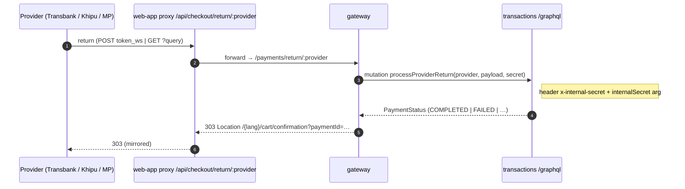

# Payment Flow — gateway layer

> The gateway is the **public HTTP edge** for payment-provider callbacks. It owns
> no payment state — it forwards provider return-URLs and webhooks to the
> transactions subgraph's internal GraphQL mutations, then redirects the buyer
> back to the web app.
>
> Full cross-repo picture + diagrams: [`ekoru-web-app/docs/PAYMENT_FLOW.md`](../../ekoru-web-app/docs/PAYMENT_FLOW.md).
> Subgraph internals: [`ekoru-transactions/docs/PAYMENT_FLOW.md`](../../ekoru-transactions/docs/PAYMENT_FLOW.md).
> Route/env changelog: [`CHECKOUT.md`](./CHECKOUT.md).

Code: [`src/payments/payments.controller.ts`](../src/payments/payments.controller.ts) · [`src/payments/payments.service.ts`](../src/payments/payments.service.ts)

---

## 1. Why the gateway is in the path

Providers need a **public** URL to redirect/POST to; the transactions subgraph is
internal-only. The gateway:

- terminates the provider callback,
- authenticates itself to the subgraph with `INTERNAL_SERVICE_SECRET` (never exposes DB creds to the edge),
- translates the callback into a `processProviderReturn` / `processProviderWebhook` GraphQL call,
- steers the buyer's browser to the localized confirmation page.

It deliberately **does not** decide payment outcome — the subgraph does (it runs `tx.commit`, verifies signatures, etc.).



---

## 2. Routes

### 2.1 `POST /payments/return/webpay`
Transbank posts the buyer back here (form-encoded). Body merged with query, forwarded to the subgraph.

```http
POST /payments/return/webpay
Content-Type: application/x-www-form-urlencoded

token_ws=01ab...e9
```
Cancel/timeout variants carry `TBK_TOKEN` / `TBK_ORDEN_COMPRA` / `TBK_ID_SESION` instead. All four shapes are forwarded verbatim — the subgraph's Webpay adapter classifies them (see subgraph doc §Webpay return table).

**Response:** `303` redirect to `{webAppOrigin}/{lang}/cart/confirmation?paymentId=…`.
`webAppOrigin` = `Referer` origin if present, else `WEB_APP_BASE_URL`. `lang` = `NEXT_LOCALE` cookie or `es`.

### 2.2 `GET /payments/return/:provider`  (`khipu`, `mercadopago`)
GET-style returns with provider query params. Unknown provider → `400 Unknown provider`. Same forward + `303` behavior.

```http
GET /payments/return/mercadopago?collection_id=123&status=approved&external_reference=ekoru-4021
```

### 2.3 `POST /payments/webhook/khipu`
Server-to-server IPN. Rejects requests missing `x-khipu-signature` (cheap filter); the **subgraph re-verifies** the HMAC after looking up the payment (per-seller secret). `eventType` = body `event` or `"notify"`.

```jsonc
// → { ok: true }  on accept,  { ok: false } if unsigned
```

### 2.4 `POST /payments/webhook/mercadopago`
IPN. `eventType` = body `type` or `?topic` or `"notification"`. Empty body → `{ ok: false }`.
**TODO:** verify `x-signature` HMAC against the seller's webhook secret (deferred to the subgraph, same as Khipu).

> Webpay has **no** webhook — its return-URL POST is the only signal.

---

## 3. Gateway → subgraph call (internal)

[`PaymentsService`](../src/payments/payments.service.ts) calls the transactions GraphQL endpoint **directly** (not through the federated public gateway), with the shared secret sent **both** ways:

```jsonc
POST {EKORU_TRANSACTIONS_<ENV>_URL}
Headers: { "Content-Type": "application/json", "x-internal-secret": "<INTERNAL_SERVICE_SECRET>" }
Body (return):
{
  "query": "mutation ProcessReturn($provider: ChileanPaymentProvider!, $payload: JSON!, $secret: String!) { processProviderReturn(provider: $provider, payload: $payload, internalSecret: $secret) }",
  "variables": { "provider": "WEBPAY", "payload": { "token_ws": "01ab...e9" }, "secret": "<INTERNAL_SERVICE_SECRET>" }
}
Body (webhook):
{
  "query": "mutation ProcessWebhook($provider: ChileanPaymentProvider!, $eventType: String!, $payload: JSON!, $secret: String!) { processProviderWebhook(provider: $provider, eventType: $eventType, payload: $payload, internalSecret: $secret) }",
  "variables": { "provider": "KHIPU", "eventType": "notify", "payload": { /* raw IPN */ }, "secret": "<…>" }
}
```
Response: `{ "data": { "processProviderReturn": "COMPLETED" } }`. Any GraphQL `errors[]` → the controller logs and still redirects the buyer to the confirmation page (which will show the non-terminal state and keep polling).

The `<ENV>` prefix is chosen from `ENVIRONMENT`: `development→DEV`, `staging→STAGING`, else `PROD`. A missing `EKORU_TRANSACTIONS_<ENV>_URL` or `INTERNAL_SERVICE_SECRET` throws before any provider call.

---

## 4. `paymentId` in the redirect

For Webpay, the controller derives the order id from `TBK_ORDEN_COMPRA` (`ekoru-<orderId>-<base36>`) purely to build the redirect query string; the **canonical `paymentId` comes from the subgraph**. Other providers return the id via the subgraph result. If nothing resolves, the buyer still lands on `/confirmation` (no `paymentId`) and the page shows a generic pending state.

---

## 5. Adding a provider (gateway side)

- **GET return** → already covered by `GET /payments/return/:provider`; just make `_normalizeProvider` accept the new id.
- **POST return** (form-post like Webpay) → add an explicit `@Post('return/<provider>')` handler.
- **Webhook** → add `@Post('webhook/<provider>')`, do a cheap presence/signature check, call `payments.processWebhook('<PROVIDER>', eventType, body)`.
- Add the id to the `ProviderId` union in both controller and service.

Deep verification (HMAC, commit) belongs in the **subgraph adapter**, not here — the gateway doesn't know which seller a callback is for until the subgraph looks up the payment.

---

## 6. Env vars

```ini
ENVIRONMENT=staging
EKORU_TRANSACTIONS_STAGING_URL=http://localhost:4007/graphql   # match ENVIRONMENT prefix
INTERNAL_SERVICE_SECRET=<identical to ekoru-transactions>
WEB_APP_BASE_URL=http://localhost:3000                         # fallback when Referer absent
```
`INTERNAL_SERVICE_SECRET` **must be byte-for-byte identical** to the subgraph's, or every internal mutation returns `Unauthorized`.
